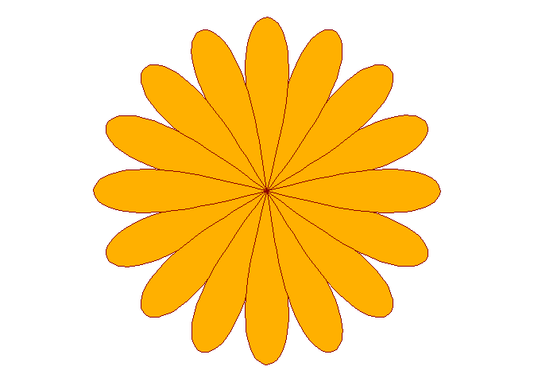
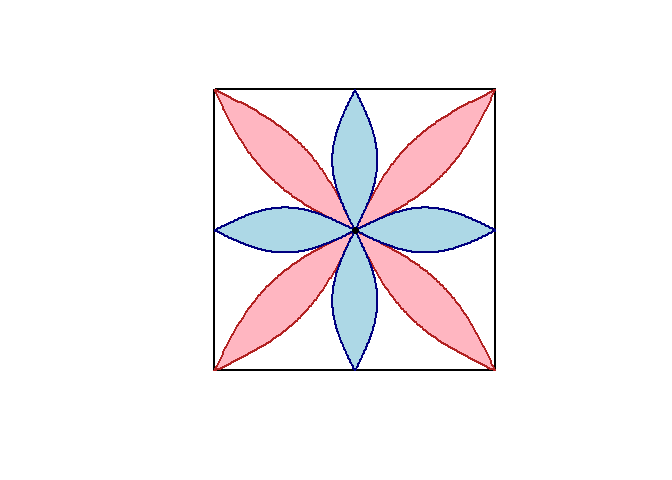
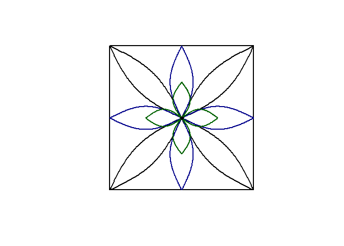

<!-- README.md is generated from README.Rmd. Please edit that file -->

# srilankamotif

<!-- badges: start -->

<!-- badges: end -->

This package is developed to generate Sri Lankan-inspired artistic
motifs using R through mathematical and geometric constructions. Beyond
its visual outputs, the package serves an educational purpose by
demonstrating how mathematics can be translated into art through coding,
helping users strengthen their programming skills, particularly in data
visualization and functional programming in R, while engaging in
creative exploration.

## Installation

You can install the development version of srilankamotif from
[GitHub](https://github.com/) with:

``` r
# install.packages("pak")
pak::pak("thiyangt/srilankamotif")
```

``` r
library(srilankamotif)
library(ggplot2)
```

## Example

``` r
library(srilankamotif)
## basic example code
generate_flower()
```



``` r
draw_dual_2flowers()
```



``` r
generate_binara_3flower()
```


